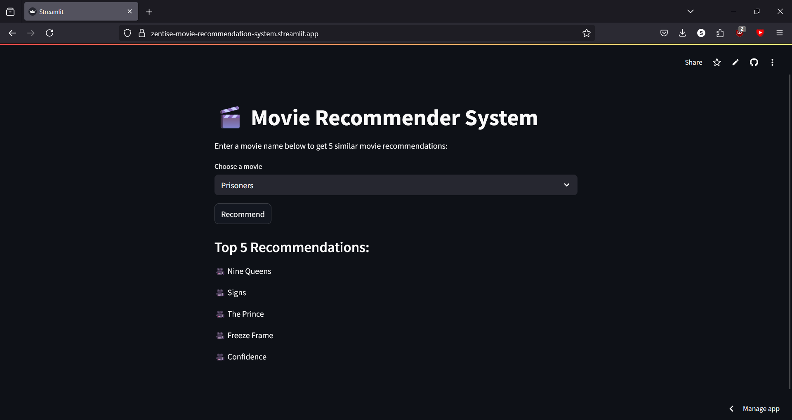

# 🎬 Movie Recommender System

A content-based movie recommendation system built using metadata from the TMDB 5000 dataset.  
It uses NLP techniques (Bag-of-Words + Cosine Similarity) to recommend similar movies based on overview, genre, cast, and keywords.

🌐 **Live Demo**: [zentise-movie-recommendation-system.streamlit.app](https://zentise-movie-recommendation-system.streamlit.app/)

---

## 🚀 Features

- Search for any movie from the dataset
- Get 5 most similar movies using content-based filtering
- Clean and responsive UI built with Streamlit
- Fast local recommendations (no external APIs used)

---

## 🧠 Tech Stack

- Python 
- pandas, scikit-learn
- CountVectorizer (Bag-of-Words)
- Cosine Similarity
- Streamlit for UI

---

## 🗂 Dataset

- TMDB 5000 Movies Dataset  
  Source: [Kaggle](https://www.kaggle.com/datasets/tmdb/tmdb-movie-metadata)

---

## 🛠 How to Run Locally

1. Clone the repository:
```bash
git clone https://github.com/Zentise/Movie-Recommendation-System.git
cd Movie-Recommendation-System
```

2. Install requirements:
```bash
pip install -r requirements.txt
```

3. Run the app:
```bash
streamlit run streamlit_app.py
```

---

## 📸 Screenshot



---

## ✍️ Author

**Shrijith S Menon**  
Portfolio: [shrijithsm.tech](https://shrijithsm.tech)
